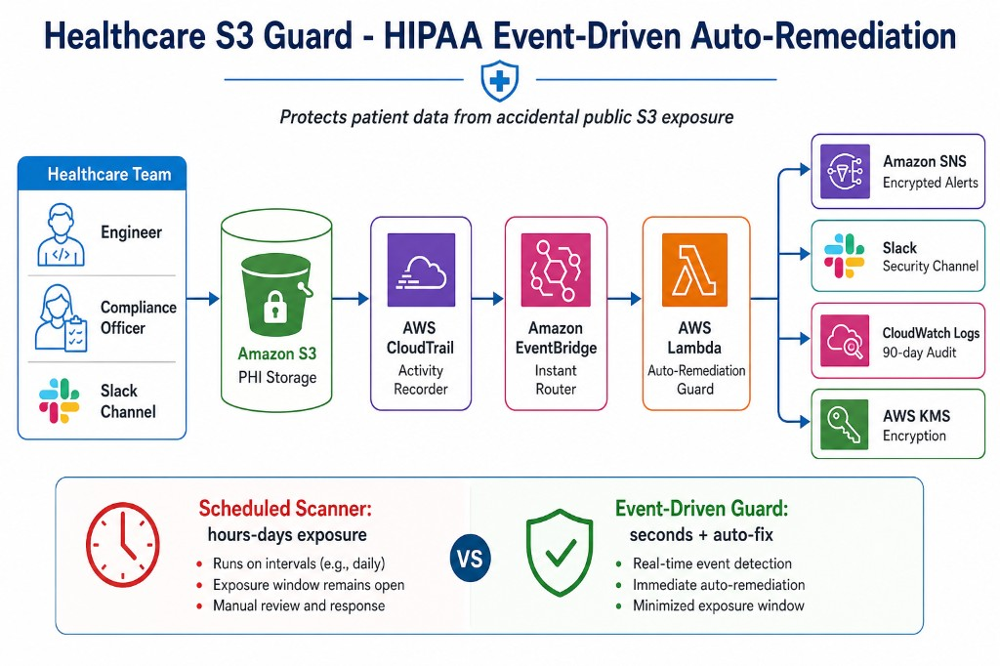

# Healthcare S3 Guard — Event-Driven HIPAA Compliance

**Protecting patient data in the cloud, automatically and in near real time.**

---

## Who is this for?

This project is built for **healthcare organizations** — hospitals, clinics, health-tech startups, billing vendors, and compliance teams — that store sensitive information in Amazon Web Services (AWS). Under **HIPAA** (the U.S. health privacy law), organizations must protect **Protected Health Information (PHI)** from unauthorized access.

One of the most common and dangerous mistakes in the cloud is accidentally making an **Amazon S3 storage bucket public** — meaning anyone on the internet could potentially view patient files, lab results, or backups.

This system acts like a **24/7 security guard** that watches for that mistake the moment it happens, fixes it within seconds, and alerts your team on Slack.

## Tech stack

| Layer | Technology |
|-------|------------|
| Infrastructure | **Terraform** (modular AWS IaC) |
| Remediation logic | **TypeScript** on **AWS Lambda** (Node.js 20) |
| Event routing | **CloudTrail** + **Amazon EventBridge** |
| Alerting | **Amazon SNS** + **Slack** incoming webhook |
| Encryption | **AWS KMS** |
| Audit logs | **Amazon CloudWatch Logs** |

---

## Architecture at a glance



---

## The problem

Imagine a hospital stores patient records in a digital filing cabinet (an S3 bucket). A well-meaning engineer creates a new cabinet but forgets to lock it. Without this system:

- The cabinet might sit **unlocked for hours or days** before a scheduled security scan finds it.
- During that window, PHI could be exposed — a serious HIPAA violation with legal, financial, and reputational consequences.

Traditional compliance tools (like monthly audits or daily scans) are like **nightly security patrols**. They are useful, but they leave gaps during the day.

---

## How this solution works

This stack uses an **event-driven** pattern — it reacts the instant something risky happens, not hours later.

### Step by step (non-technical)

1. **Someone creates or changes an S3 bucket** in your AWS account (for example, a new folder for medical imaging).
2. **CloudTrail** records that action — like a security camera logging who did what and when.
3. **EventBridge** notices the specific risky actions: creating a bucket or changing its access control list (ACL).
4. **The Lambda guard bot** wakes up immediately and asks: *"Is this bucket exposed to the public internet?"*
5. If yes, it **automatically locks the bucket** by enabling Block Public Access — before an attacker or curious browser can reach PHI.
6. It sends an **alert to your Slack channel** so your security or compliance team knows what happened, what was fixed, and when.
7. Every action is **logged to CloudWatch** for your HIPAA audit trail (who, what, when, outcome).

---

## Why this matters for HIPAA

HIPAA's **Security Rule** requires covered entities to implement safeguards that protect electronic PHI (ePHI). Relevant themes this project addresses:

| HIPAA theme | How this project helps |
|-------------|------------------------|
| **Access control** | Prevents unintended public access to storage holding PHI |
| **Audit controls** | CloudWatch logs record every detection and remediation |
| **Integrity** | Auto-remediation restores secure configuration immediately |
| **Transmission/security** | KMS encrypts alerts and Lambda secrets at rest |

**Scheduled scanners** (AWS Config, Security Hub, third-party tools) are still valuable for broad posture checks. This project **complements** them by closing the gap between "something went wrong" and "someone noticed."

---

## What gets deployed

| Component | Role in healthcare terms |
|-----------|-------------------------|
| **CloudTrail** | Security camera — records all AWS API activity |
| **EventBridge** | Triage nurse — routes urgent events to the right responder |
| **Lambda** | Automated guard — inspects and fixes the bucket |
| **SNS** | Pager system — encrypted alert bus for future channels (email, SMS) |
| **Slack webhook** | Team notification — instant message to your security channel |
| **KMS** | Locked safe — encrypts alerts and application secrets |
| **IAM** | ID badge system — each component gets only the permissions it needs |
| **CloudWatch Logs** | Chart notes — 90-day audit trail of guard actions |

---

## Architecture diagram (Lucidchart / draw.io)

A full editable architecture diagram is available for compliance presentations and security reviews:

- **Editable file:** [`docs/healthcare-s3-remediation-architecture.drawio`](docs/healthcare-s3-remediation-architecture.drawio)
- **Visual export:** [`docs/architecture-diagram.png`](docs/architecture-diagram.png)

---

## Quick start (technical)

```bash
chmod +x scripts/deploy.sh scripts/destroy.sh
cp terraform/environments/dev/terraform.tfvars.example terraform/environments/dev/terraform.tfvars
# Edit terraform.tfvars — set slack_webhook_url
./scripts/deploy.sh
```

---

## Project structure

```
Healthcare Compliance/
├── README.md                 ← You are here (healthcare overview)
├── docs/
│   ├── architecture-diagram.png
│   └── healthcare-s3-remediation-architecture.drawio
├── scripts/
│   ├── deploy.sh
│   └── destroy.sh
└── terraform/                ← Infrastructure as Code
    ├── README.md             ← Technical deployment guide
    ├── modules/
    │   ├── kms/ sns/ iam/ eventbridge/
    │   └── lambda/           ← TypeScript remediation handler (src/index.ts)
    └── environments/dev/
```

---

## Important notes for compliance teams

- This tool **automatically remediates** a specific class of misconfiguration (S3 public exposure). It does not replace a full HIPAA compliance program, BAA agreements with AWS, workforce training, or broader risk assessments.
- Ensure **CloudTrail** is enabled and logging management events before relying on the event-driven path.
- Review CloudWatch logs regularly and retain them per your organization's policy (default: 90 days).
- Slack webhooks should post to a **private channel** accessible only to authorized staff.

---

*Built for healthcare compliance teams who need speed, automation, and an audit trail — not just another quarterly checklist.*
