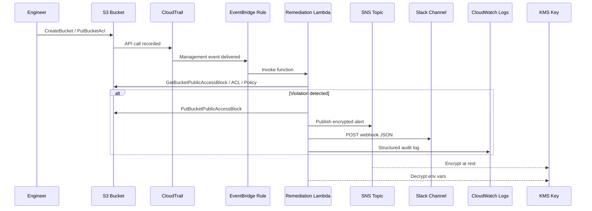
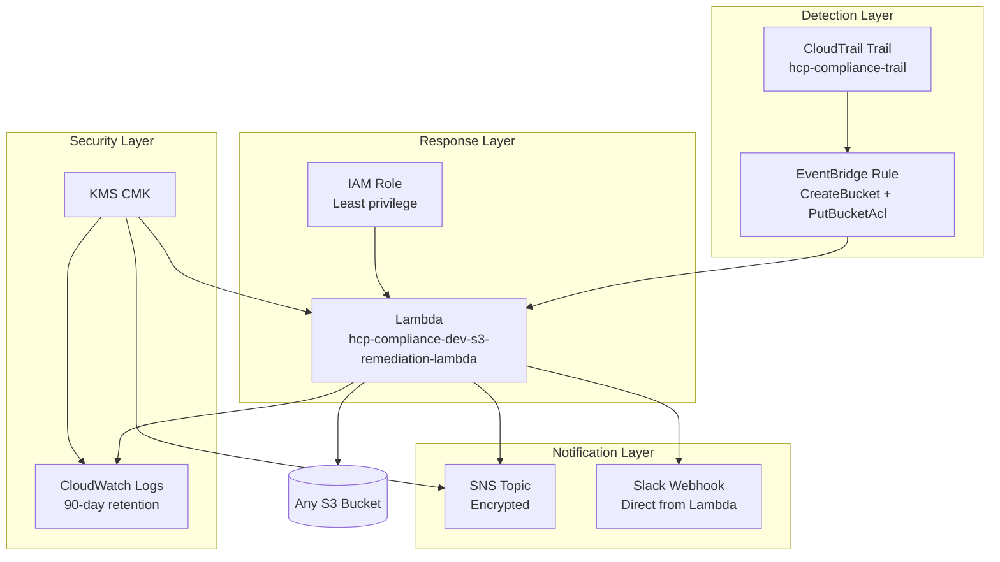

# Terraform Deployment Guide — Healthcare S3 Guard

Technical reference for deploying the HIPAA-oriented S3 auto-remediation stack. For a plain-language healthcare overview, see the [project README](../README.md).

**Languages:** Terraform (HCL) + **TypeScript** (Lambda remediation handler in [`modules/lambda/src/index.ts`](modules/lambda/src/index.ts))

---

## Architecture



### Component map



**Architecture image:** [`../docs/architecture-diagram.png`](../docs/architecture-diagram.png)

**Editable diagram (Lucidchart / draw.io):** [`../docs/healthcare-s3-remediation-architecture.drawio`](../docs/healthcare-s3-remediation-architecture.drawio)

---

## Prerequisites

| Requirement | Why |
|-------------|-----|
| AWS CLI configured | Deploy and test resources |
| Terraform >= 1.5 | Apply infrastructure |
| Node.js >= 18 | Build Lambda TypeScript bundle |
| CloudTrail with logging | Without it, EventBridge never receives S3 API events |

Verify CloudTrail:

```bash
aws cloudtrail get-trail-status --name hcp-compliance-trail --region us-east-1
```

---

## Deploy

```bash
# From project root
chmod +x scripts/deploy.sh scripts/destroy.sh
cp terraform/environments/dev/terraform.tfvars.example terraform/environments/dev/terraform.tfvars
./scripts/deploy.sh
```

## Destroy

```bash
./scripts/destroy.sh      # interactive
./scripts/destroy.sh -y   # no prompt
```

---

## Configuration

| Variable | Description | Default |
|----------|-------------|---------|
| `aws_region` | AWS region | `us-east-1` |
| `project_name` | Resource naming prefix | `hcp-compliance` |
| `environment` | Environment tag | `dev` |
| `slack_webhook_url` | Slack incoming webhook (Lambda posts directly) | `""` |
| `log_retention_days` | CloudWatch log retention | `90` |

> **Note:** Slack incoming webhooks cannot confirm SNS HTTPS subscriptions. Alerts are delivered directly from the Lambda via `fetch()` to your webhook URL.

---

## Module layout

```
terraform/modules/
├── kms/          # CMK for SNS, Lambda env vars, and CloudWatch Logs
├── sns/          # Encrypted alert topic (extensible)
├── iam/          # Least-privilege Lambda execution role
├── lambda/       # TypeScript remediation + Slack notifier (src/index.ts)
└── eventbridge/  # CloudTrail event rule + invoke permission
```

---

## Monitoring

```bash
export AWS_REGION=us-east-1
aws logs tail /aws/lambda/hcp-compliance-dev-s3-remediation-lambda --follow
```

Look for log lines: `Published alert to Slack`, `Bucket remediated`.

---

## HIPAA compliance notes

- **Near real-time** vs scheduled: EventBridge reacts within seconds of `CreateBucket` / `PutBucketAcl`; Config/Security Hub scans are periodic.
- **Least privilege**: IAM scoped to S3 read/remediate, SNS publish, KMS decrypt, CloudWatch write.
- **Encryption**: KMS at rest for SNS, Lambda secrets, and log group.
- **Audit trail**: Every invocation logged to CloudWatch with structured JSON.
